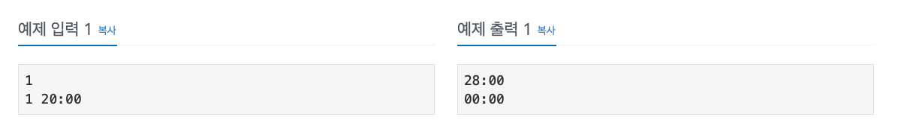
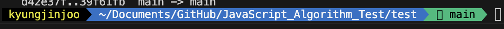

# 문제 풀이 현황

|                      ID                       |                         Profile                          |                                                                      Solved                                                                       |
| :-------------------------------------------: | :------------------------------------------------------: | :-----------------------------------------------------------------------------------------------------------------------------------------------: |
|       [10o0o](https://github.com/10o0o)       |        |    [!](./id/10o0o.md)    |
| [moonjonghoo](https://github.com/moonjonghoo) |  | [!](./id/moonjonghoo.md) |
|     [rud1676](https://github.com/rud1676)     |      |   [!](./id/rud1676.md)   |

# 🧮 JavaScript Alghorithm Test

자바스크립트로 알고리즘문제를 풀기 위한 레포입니다!

### 진행 현황 표

| 주차                                   | 문제                                                                                                                                                                                                                                                                                                                                                                                                                                                                                                                                                                                                                                                                                                                                                                                   |
| -------------------------------------- | -------------------------------------------------------------------------------------------------------------------------------------------------------------------------------------------------------------------------------------------------------------------------------------------------------------------------------------------------------------------------------------------------------------------------------------------------------------------------------------------------------------------------------------------------------------------------------------------------------------------------------------------------------------------------------------------------------------------------------------------------------------------------------------- |
| [1주-해시스텍큐](./2nd/week1/)         | [프로그래머스-해시-문제집](https://school.programmers.co.kr/learn/courses/30/parts/12077), [프로그래머스-스택큐-문제집](https://school.programmers.co.kr/learn/courses/30/parts/12081)                                                                                                                                                                                                                                                                                                                                                                                                                                                                                                                                                                                                 |
| [2주-누적합,문자열,구현](./2nd/week2/) | [호탤대실](https://school.programmers.co.kr/learn/courses/30/lessons/155651),[파괴되지-않은-건물](https://school.programmers.co.kr/learn/courses/30/lessons/92344) ,[모음사전](https://programmers.co.kr/learn/courses/30/lessons/84512),[광고삽입](https://school.programmers.co.kr/learn/courses/30/lessons/72414),[괄호회전](https://school.programmers.co.kr/learn/courses/30/lessons/76502),[압축](https://programmers.co.kr/learn/courses/30/lessons/17684),[행렬곱](https://school.programmers.co.kr/learn/courses/30/lessons/12949),[멀쩡한사각형](https://school.programmers.co.kr/learn/courses/30/lessons/62048),[삼각달팽이](https://school.programmers.co.kr/learn/courses/30/lessons/68645),[스킬트리](https://school.programmers.co.kr/learn/courses/30/lessons/49993#) |
| [3주-DFS,BFS](./2nd/week3/)            | [가장먼노드](https://school.programmers.co.kr/learn/courses/30/parts/14393),[순위](https://school.programmers.co.kr/learn/courses/30/lessons/49191),[전력망](https://school.programmers.co.kr/learn/courses/30/lessons/86971),[프로그래머스-DFS-문제집](https://school.programmers.co.kr/learn/courses/30/parts/12421)                                                                                                                                                                                                                                                                                                                                                                                                                                                                 |
| [4주-완전탐색](./2nd/week4/)           | [프로그래머스-완전탐색-문제집](https://school.programmers.co.kr/learn/courses/30/parts/12230),[양궁대회](https://school.programmers.co.kr/learn/courses/30/lessons/92342),[치킨배달](https://www.acmicpc.net/problem/15686),[보물섬](https://www.acmicpc.net/problem/2589),[불!](https://www.acmicpc.net/problem/4179),[사다리조작](https://www.acmicpc.net/problem/15684),[Rooms](https://leetcode.com/problems/keys-and-rooms/description/)                                                                                                                                                                                                                                                                                                                                          |
| [5주-비트마스킹](./2nd/week5/)         | [후보키](https://school.programmers.co.kr/learn/courses/30/lessons/42890), [2개이하다른비트](https://school.programmers.co.kr/learn/courses/30/lessons/77885),[불량사용자](https://school.programmers.co.kr/learn/courses/30/lessons/64064),[외벽점검](https://school.programmers.co.kr/learn/courses/30/lessons/60062),[순위검색](https://school.programmers.co.kr/learn/courses/30/lessons/72412),[Square](https://leetcode.com/problems/matchsticks-to-square/),[오아시스재결합](https://www.acmicpc.net/problem/3015),[Partition](https://leetcode.com/problems/partition-to-k-equal-sum-subsets/description/),[NSquare](https://leetcode.com/problems/number-of-squareful-arrays/description/),[메뉴리뉴얼](https://school.programmers.co.kr/learn/courses/30/lessons/72411)      |
| [6주-그리디,투포인터](./2nd/week6)     | [그리디프로그래머스문제집](https://school.programmers.co.kr/learn/courses/30/parts/12244), [택배배달](https://school.programmers.co.kr/learn/courses/30/lessons/150369),[미로탈출명령어](https://school.programmers.co.kr/learn/courses/30/lessons/150365),[무지의먹방라이브](https://school.programmers.co.kr/learn/courses/30/lessons/42891),[보석쇼핑](https://school.programmers.co.kr/learn/courses/30/lessons/67258)                                                                                                                                                                                                                                                                                                                                                             |
| [7주-라인스위핑,이분탐색](./2nd/week7) | [요격시스템](https://school.programmers.co.kr/learn/courses/30/lessons/181188), [추석트래픽](https://school.programmers.co.kr/learn/courses/30/lessons/17676),[RectangleArea](https://leetcode.com/problems/rectangle-area-ii/description/),[Maximum~](https://leetcode.com/problems/maximum-beauty-of-an-array-after-applying-operation/),[징검다리](https://school.programmers.co.kr/learn/courses/30/lessons/43236),[금과은운반](https://school.programmers.co.kr/learn/courses/30/lessons/86053),[징검다리건너기](https://school.programmers.co.kr/learn/courses/30/lessons/64062),[선긋기](https://www.acmicpc.net/problem/2170)                                                                                                                                                  |
| [8주-DP](./2nd/week8)                  | [프로그래머스DP문제집5문제](https://school.programmers.co.kr/learn/courses/30/parts/12263),[MinimumPath](https://leetcode.com/problems/minimum-path-sum/description/),[CountNumber](https://leetcode.com/problems/count-numbers-with-unique-digits/description/),[매출하락최소화](https://school.programmers.co.kr/learn/courses/30/lessons/72416)                                                                                                                                                                                                                                                                                                                                                                                                                                     |
| [9주-최단거리](./2nd/week9)            | [순위](https://school.programmers.co.kr/learn/courses/30/lessons/49191),[미로탈출명령어](https://school.programmers.co.kr/learn/courses/30/lessons/150365),[미로탈출](https://school.programmers.co.kr/learn/courses/30/lessons/81304),[NetworkDelaytime](https://leetcode.com/problems/network-delay-time/description/),[KHeighst~](https://leetcode.com/problems/k-highest-ranked-items-within-a-price-range/description/),[거리두기확인](https://school.programmers.co.kr/learn/courses/30/lessons/81302),[보행자천국](https://school.programmers.co.kr/learn/courses/30/lessons/1832)                                                                                                                                                                                              |
| [10주-팬윅트리](./2nd/week10)          | ..                                                                                                                                                                                                                                                                                                                                                                                                                                                                                                                                                                                                                                                                                                                                                                                     |

## 📔규칙과 공부방법

### 진행

- 월요일 ~ 금요일: 선정된 문제들을 푸는 기간입니다
- 주말: 마저 풀지 못햇던것을 풀고 풀이를 레포지토리에 올리고 PR을 보냅니다. 폴더구조는 아래의 이미지를 참조합니다.(주말에 문제가 선정이 됩니다.)

협의 후에 모여서 코테문제를 라이브코딩하는 시간을 일주일에 온라인으로 1번 또는 2번 가집니다!

라이브코딩하는 문제는 월요일에 미리 언급드립니다 해당문제 제외하고 본인이 푸시면 됩니다.

톡방에서 문제풀이에 관한 이야기는 자유롭게 가능합니다!

### 알림

- 4주차 까지는 평일에 매일 2문제씩 푸는 양으로 해놧습니다! 5주차 이후로는 1~2문제씩 푸는 느낌으로 진행합니다.
- 난이도는 한문제에 40~50분 걸리는 정도로 선정을 하려고합니다(저도 안풀어보는 문제들이라 미스가 날 수 도있어서 5주차이후로는 1,2문제씩 선정할 예정)

코딩테스트는 쉬운 문제만 풀면 절대 안늘어요!! 계속 연습하고 있지만 항상 쉬운문제만 찾다가 삽질을 많이해서 시간을 많이 날린 것 같네요..

## ✍️ 문제 푸는 방법

0. README.md의 해당 주차에 풀 문제들을 확인한다. 링크로 들어가서 확인
1. 현재 년도와 현재 주차 폴더로 들어간다. ex)24년도 1월 11일 이라면 1월 둘째주 이므로 2024/1_2폴더로 들어가서 작성한 코드를 저장한다.
2. 문제번호\_아이디.js로 저장한다.


## 👨‍💻참여방법

1. 이 프로젝트를 Fork 한다.
2. Fork된 프로젝트에서 git clone을 한다.
3. git remote add upstream https://github.com/rud1676/JavaScript_AlgorithmTest.git 명령으로 upstream에 이 프로젝트의 주소를 저장한다.
4. git remote add origin {fork된 내원격 저장소}
5. 코딩테스트 푼 코드를 위의 규칙대로 작성하고 commit작성 후에, main에 push를 한다.
6. 나의 fork된 저장소에 PR탭으로 들어가 new pull request를 생성한다.

[링크](https://velog.io/@jisubin12/Github-외부저장소-fork-pull-request-동기화-하기) 를 보면서 작성한 가이드라인입니다.

## ⌨️ 백준에서 Nodejs입력받는 법.

```js
// 1. 하나의 값을 입력받을 때
const input = require("fs")
  .readFileSync(process.platform === "linux" ? "/dev/stdin" : "./input.txt")
  .toString()
  .trim();

// 2. 공백으로 구분된 한 줄의 값들을 입력받을 때
const input = require("fs")
  .readFileSync(process.platform === "linux" ? "/dev/stdin" : "./input.txt")
  .toString()
  .trim()
  .split(" ");

// 3. 여러 줄의 값들을 입력받을 때
const input = require("fs")
  .readFileSync(process.platform === "linux" ? "/dev/stdin" : "./input.txt")
  .toString()
  .trim()
  .split("\n");

// 4. 첫 번째 줄에 자연수 n을 입력받고, 그 다음줄에 공백으로 구분된 n개의 값들을 입력받을 때
const [n, ...arr] = require("fs")
  .readFileSync(process.platform === "linux" ? "/dev/stdin" : "./input.txt")
  .toString()
  .trim()
  .split(/\s/);

// 5. 첫 번째 줄에 자연수 n을 입력받고, 그 다음줄부터 n개의 줄에 걸쳐 한 줄에 하나의 값을 입력받을 때
const [n, ...arr] = require("fs")
  .readFileSync(process.platform === "linux" ? "/dev/stdin" : "./input.txt")
  .toString()
  .trim()
  .split("\n");

// 6. 하나의 값 또는 공백으로 구분된 여러 값들을 여러 줄에 걸쳐 뒤죽박죽 섞여서 입력받을 때
// ex) n 입력 - 공백으로 구분된 n개의 값 입력 - m 입력 - 여러 줄에 걸쳐 m개의 값 입력
const input = require("fs")
  .readFileSync(process.platform === "linux" ? "/dev/stdin" : "./input.txt")
  .toString()
  .trim()
  .split(/\s/);
const n = input[0];
const n_arr = input.slice(1, n + 1);
const [m, ...m_arr] = input.slice(n + 1);

// 2~6에서 입력받는 값들을 모두 String에서 Number로 바꾸려면 split()뒤에 .map(v => +v)를 추가

// input.shift()를 이용해 한줄씩 입력받는 상황으로 만들 수 있음!
```

로컬에서 테스트 할땐 input값을 푸는 디렉토리의 input.txt파일에 입력한다.

[출처](https://jaehyun2yo.tistory.com/17)

## 코딩테스트에 필요한 지식들

- [코딩테스트에 필요한 Javascript 개념(작성중)](./Javascript.md)
- [코딩테스트 접근법](./HowToSolved.md)

## 🤽🏻‍♂️ vscode에서 환경셋팅하기

이건 제가 셋팅해놓은 환경을 공유하는 겁니다!

1. 풀이환경 셋팅하기

.gitignore에 /test폴더는 무시하게 적용했습니다 이를 활용하여..

test/폴더를 생성합니다. 그 안에 coding.js 와 input.txt를 만듭니다.


npm install -g nodemon 명령으로 nodemon을 설치합니다.

코드를 작성하고 터미널로 test폴더로 들어가 nodemon coding.js로 실행합니다. -> 변경사항 생길시 자동으로 실행해줘서 편합니다!

2. 실제로 풀기 - 예제입력 입력하고 확인하기

input.txt에는 예제입력을 입력합니다!

예를 들어 문제에 나온 예시가



이와 같다면

input.txt는...

```
1
1 20:00
```

로 적어주시면 됩니다

그리구 test폴더로 들어옵니다! 아래사진과 같이 경로를 확인 한 뒤에..



nodemon coding.js로 실행합니다. 코드를 수정하며 콘솔에 예제 출력값이 나오게 끔 문제를 풀면 됩니다!! => nodemon은 수정할 때 마다 자동으로 실행해줘서 문제풀때 편합니다!
