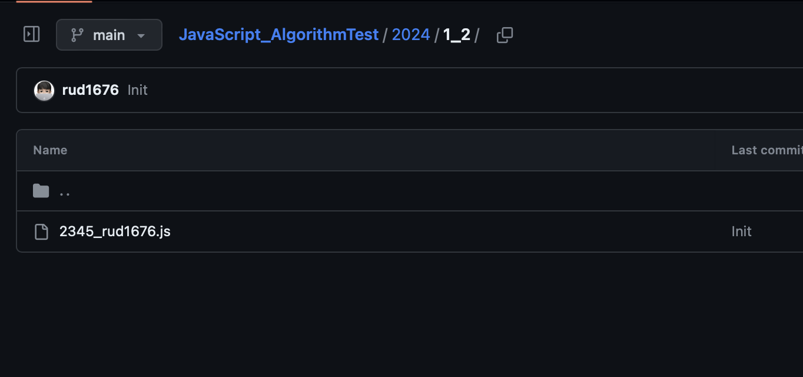

# 🧮 JavaScript Alghorithm Test

자바스크립트로 알고리즘문제를 풀기 위한 레포입니다! 주마다 최소 5문제 푸는게 목표이며, 초반엔 주제별로, 이후엔 난이도별로 문제를 픽합니다.

## 문제 선정 개요

- 1월 : 브론즈 - 실버 문제 위주로 선정
  - 3주차 부터 dfs, bfs위주로!
- 2월 : 그리디 알고리즘 문제 포함.

---

### 2024

| 주차                    | 문제                                                                                                                                                                                                                    |
| ----------------------- | ----------------------------------------------------------------------------------------------------------------------------------------------------------------------------------------------------------------------- |
| [1월2주차](./2024/1_2/) | [2979](https://www.acmicpc.net/problem/2979), [1159](https://www.acmicpc.net/problem/1159), [1629](https://www.acmicpc.net/source/share/18c305ece6324314ad0b7c6941ed9b30), [4375](https://www.acmicpc.net/problem/4375) |

## 📔규칙과 공부방법

백준에 나와있는 문제들을 선정합니다.

- 월요일: 문제를 5개 선정하고 담당자를 선정합니다. README에 선정한 문제를 표에 업로드합니다.
- ~ 금요일: 문제를 풀고 파일로 작성합니다.
- 주말: 마저 풀지 못햇던것을 풀고 풀이를 레포지토리에 올리고 PR을 보냅니다. 폴더구조는 아래의 이미지를 참조합니다.

담당자는 임시로 본인이 다 처리함!

취준 모임 톡방에 참여하신 분들에 한에서 문제마다 참여하신 분들을 톡방에다가 매주 일요일마다 올려서 동기부여를 하겠습니다!!

ex) 아래와 같이 매주 금요일마다 카톡이 올라옵니다!

```
1월 2주차 Javascript코딩테스트 참여자
불참자: @rud1676
2979
@rudwls96 @rud15
2971
@rudwls96 @rud15
```

## ✍️ 문제 푸는 방법

0. README.md의 해당 주차에 풀 문제들을 확인한다. 링크로 들어가서 확인
1. 현재 년도와 현재 주차 폴더로 들어간다. ex)24년도 1월 11일 이라면 1월 둘째주 이므로 2024/1_2폴더로 들어가서 작성한 코드를 저장한다.
2. 문제번호\_아이디.js로 저장한다.



## 👨‍💻참여방법

1. 이 프로젝트를 Fork 한다.
2. Fork된 프로젝트에서 git clone을 한다.
3. git remote add upstream https://github.com/rud1676/JavaScript_AlgorithmTest.git 명령으로 upstream에 이 프로젝트의 주소를 저장한다.
4. git remote add origin {fork된 내원격 저장소}
5. 코딩테스트 푼 코드를 위의 규칙대로 작성하고 commit, upstream으로 push를 한다.
6. 나의 fork된 저장소에 PR탭으로 들어가 new pull request를 생성한다.

이때 어떤 문제를 풀었는지 어떻게 풀었는지 번호를 적고 PR을 생성한다.

예시

```
2453 백준
이분탐색

2433 백준
DFS

2542 백준
그리디
```

이후에 작업할 땐...

- git fetch upstream 으로 원격 저장소의 최신내용을 가져온다.
- git checkout main
- git merge upstream/main
- git push origin main
  으로 나의 원격 저장소와 최신화 시켜준다.

[링크](https://velog.io/@jisubin12/Github-외부저장소-fork-pull-request-동기화-하기) 를 보면서 작성한 가이드라인입니다.

## ⌨️ 백준에서 Nodejs입력받는 법.

```js
// 1. 하나의 값을 입력받을 때
const input = require("fs")
  .readFileSync(process.platform === "linux" ? "/dev/stdin" : "./input.txt")
  .toString()
  .trim();

// 2. 공백으로 구분된 한 줄의 값들을 입력받을 때
const input = require("fs")
  .readFileSync(process.platform === "linux" ? "/dev/stdin" : "./input.txt")
  .toString()
  .trim()
  .split(" ");

// 3. 여러 줄의 값들을 입력받을 때
const input = require("fs")
  .readFileSync(process.platform === "linux" ? "/dev/stdin" : "./input.txt")
  .toString()
  .trim()
  .split("\n");

// 4. 첫 번째 줄에 자연수 n을 입력받고, 그 다음줄에 공백으로 구분된 n개의 값들을 입력받을 때
const [n, ...arr] = require("fs")
  .readFileSync(process.platform === "linux" ? "/dev/stdin" : "./input.txt")
  .toString()
  .trim()
  .split(/\s/);

// 5. 첫 번째 줄에 자연수 n을 입력받고, 그 다음줄부터 n개의 줄에 걸쳐 한 줄에 하나의 값을 입력받을 때
const [n, ...arr] = require("fs")
  .readFileSync(process.platform === "linux" ? "/dev/stdin" : "./input.txt")
  .toString()
  .trim()
  .split("\n");

// 6. 하나의 값 또는 공백으로 구분된 여러 값들을 여러 줄에 걸쳐 뒤죽박죽 섞여서 입력받을 때
// ex) n 입력 - 공백으로 구분된 n개의 값 입력 - m 입력 - 여러 줄에 걸쳐 m개의 값 입력
const input = require("fs")
  .readFileSync(process.platform === "linux" ? "/dev/stdin" : "./input.txt")
  .toString()
  .trim()
  .split(/\s/);
const n = input[0];
const n_arr = input.slice(1, n + 1);
const [m, ...m_arr] = input.slice(n + 1);

// 2~6에서 입력받는 값들을 모두 String에서 Number로 바꾸려면 split()뒤에 .map(v => +v)를 추가
```

로컬에서 테스트 할땐 input값을 푸는 디렉토리의 input.txt파일에 입력한다.

[출처](https://jaehyun2yo.tistory.com/17)

[코딩테스트에 필요한 Javascript 개념(작성중)](./Javascript.md)

## 🤽🏻‍♂️ vscode에서 환경셋팅하기

.gitignore에 /test폴더는 무시하게 적용했습니다 이를 활용하여..

test/폴더를 생성합니다. 그 안에 coding.js 와 input.txt를 만듭니다.


npm install -g nodemon 명령으로 nodemon을 설치합니다.

코드를 작성하고 터미널로 test폴더로 들어가 nodemon coding.js로 실행합니다. -> 변경사항 생길시 자동으로 실행해줘서 편합니다!
